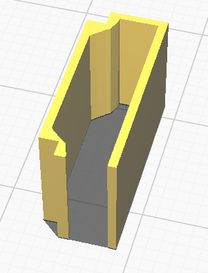

# WSMtool
A multitool adapter for the WonderSwan. Headphone, serial and link cable adapter in one.

## Idea
The idea for this multitool is to have a single adapter board which plugs into the EXT port of a WonderSwan and handle different tasks.
More specifically, this board can do the following:
* **Headphone adapter**: You can plug in regular headphones with a 3.5 mm connector and enjoy the enhanced 16b audio output.
* **Serial adapter**: Using the RP2040 Zero-based USB dongle board, you can use it as a PC serial adapter. You connect the WS adapter to the dongle via a male-to-male 3.5 mm cable (stereo cable) and connect the dongle via USB C to a computer. Useful for, e.g., WonderGate emulation, WonderWitch or ExtFriend.
* **Link cable**: Using the WSMtool link board, you can connect two WonderSwan and use a 3.5 mm audio cable (stereo) as a link cable.

## Usage
For regular headphone mode place the switch into a UP position.
For serial or link mode, place the switch into a DOWN position.

The RP2040 dongle works with [asie's ExtFriend](https://github.com/WonderfulToolchain/ws-extfriend).
It follows the same GPIO pinout, hence no changes in the code are required, it should work out of the box.
**ExtFriend Note**: The digital audio signals are not carried over to the dongle board.
This means the digital audio capture via ExtFriend is not possible.

**NOTE: NEVER connect two WonderSwan using two main boards or two link boards. Only connect two WonderSwan using one main board and one link board.**

## Parts
### Main Board
| **Reference** | **Value**| **Links**
|---------------|----------|----------|
| AUDIO1        | Vertical HDMI male connector (1.6 mm board width) |[LCSC](https://lcsc.com/product-detail/D-Sub-DVI-HDMI-Connectors_Jing-Extension-of-the-Electronic-Co-920-867A2021Y10100_C168715.html)|
| CN2           | 3.5 mm headphone jack (4 pin) |[LCSC](https://www.lcsc.com/product-detail/_SHOU-HAN-_C431535.html)
| U1            | BU9480f |[AliExpress](https://aliexpress.com/item/1005005906822526.html)|
| U2            | TDA1308T |[AliExpress](https://aliexpress.com/item/33020207730.html)|
| U3            | FSA2466UMX | [LCSC](https://www.lcsc.com/product-detail/Analog-Switches-Multiplexers_onsemi-FSA2466UMX_C457657.html)|
| SW2           | SPDT SMD switch | [LCSC](https://www.lcsc.com/product-detail/Slide-Switches_SHOU-HAN-MINI-MSK12CO2_C2681570.html)|
| R1            | 10 kOhm dual potentiometer (e.g. Alps Alpine RK10J12R0A0B) |[LCSC](https://lcsc.com/product-detail/Variable-Resistors-Potentiometers_ALPSALPINE-RK10J12R0A0B_C351175.html)|
| R2, R3, R4, R5 | 3.9 kOhm resistor (0805 SMD) ||
| R6, R7 | 10 kOhm resistor (0805 SMD) ||
| C1, C2 | 1 uF capacitor (0805 SMD) ||
| C3 | 22 uF capacitor (0805 SMD) ||
| C4 | 100 nF capacitor (0805 SMD) ||
| C6, C7 | 0 Ohm resistor (1206 SMD) ||

### Link Board
| **Reference** | **Value**| **Links**
|---------------|----------|----------|
| AUDIO1        | Vertical HDMI male connector (1.6 mm board width) |[LCSC](https://lcsc.com/product-detail/D-Sub-DVI-HDMI-Connectors_Jing-Extension-of-the-Electronic-Co-920-867A2021Y10100_C168715.html)|
| CN2           | 3.5 mm headphone jack (4 pin) |[LCSC](https://lcsc.com/product-detail/Variable-Resistors-Potentiometers_ALPSALPINE-RK10J12R0A0B_C351175.html)

### USB Dongle
| **Reference** | **Value**| **Links**
|---------------|----------|----------|
| U1            | RP2040 Zero |[AliExpress](https://aliexpress.com/item/1005004967926448.html)|
| CN2           | 3.5 mm headphone jack (4 pin) |[LCSC](https://lcsc.com/product-detail/Variable-Resistors-Potentiometers_ALPSALPINE-RK10J12R0A0B_C351175.html)

## Case
Right now, there are now cases for the WonderSwan adapters. Though, there is a case for the dongle under the STL folder.

## Connector Sleeve
In order to make the connector better fitting, I designed a sleeve for the HDMI connector which "extends" it physically to a WonderSwan EXT connector. It's 3D printable, you can find the STL here in the repo.

## Disclaimer
**Use the files and/or schematics to build your own adapter board at your own risk**.
This adapter works fine for me, but it's a simple hobby project, so there is no liability for errors in the schematics and/or board files.
**Use at your own risk**.
